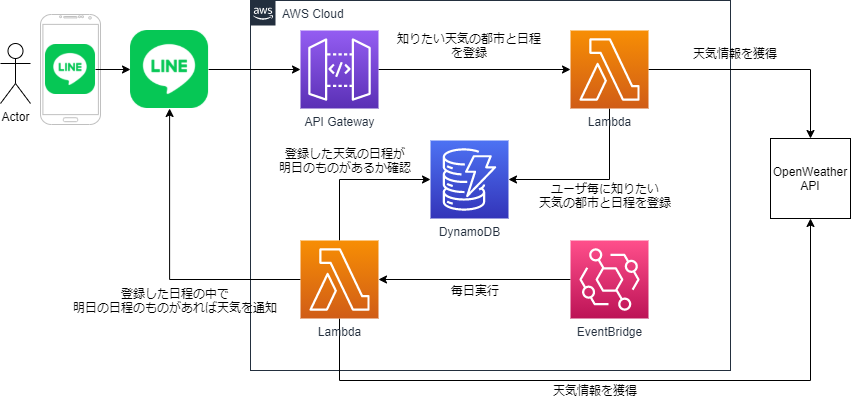

# 天気通知システム


このプロジェクトは、指定された日付の1日前にユーザーに天気情報をLINEで通知するシステムです。

## 特徴

- ユーザーはLINEを通じて日付と都市を登録できます。
- システムは指定された日の1日前に指定された都市の天気情報を取得します。
- 天気情報はLINEを通じてユーザーに送信されます。

## アーキテクチャ

システムは以下のAWSサービスを使用して構築されています：

- **AWS Lambda**: バックエンドロジックを実行するためのサービス。
- **DynamoDB**: ユーザーデータを保存するためのデータベースサービス。
- **API Gateway**: LINE webhookのエンドポイントを提供するサービス。
- **EventBridge**: 定期的なスケジュールでLambda関数をトリガーするサービス。
- **SSMパラメータストア**: APIキーやトークンを安全に保存するためのサービス。

本システムを簡易的に表した構成図は以下です。



## リポジトリ構成

リポジトリは、以下の構成です。

```
│───README.md
│───img
│   │───architecture.drawio.png
│   └───banner.png
│
└───src
    │───cloudformation.yaml
    │
    ├───line_webhook_function
    │   │───index.py
    │   └───requirements.txt
    │
    └───weather_notification_function
        │───index.py
        └───requirements.txt
```

## 前提条件

- AWSアカウント
- LINE Developersアカウント
- OpenWeatherMap APIキー
- Lambda関数コードを保存するためのS3バケット

## セットアップ

### ステップ1: SSMパラメータの作成

LINEアクセストークンとOpenWeatherMap APIキーをAWS Systems Manager Parameter Storeに保存します。

```bash
aws ssm put-parameter --name "/line/access_token" --value "your_line_access_token" --type "SecureString"
aws ssm put-parameter --name "/openweathermap/api_key" --value "your_openweathermap_api_key" --type "SecureString"
```

### ステップ2: Lambda関数コードの準備

Lambda関数用のディレクトリに必要な依存関係をインストールし、ZIPファイルにします。

#### weather_notification_function

```bash
cd src/weather_notification_function
pip install -r requirements.txt -t .
zip -r weather_notification_function.zip .
```

#### line_webhook_function

```bash
cd ../line_webhook_function
pip install -r requirements.txt -t .
zip -r line_webhook_function.zip .
```

作成したZIPファイルをS3バケットにアップロードします。

### ステップ3: CloudFormationスタックのデプロイ

CloudFormationテンプレート(src/cloudformation.yaml)を使用してスタックをデプロイします。
Lambda関数コードをアップロードした適切なS3バケット名を指定してください。

AWS Management ConsoleまたはAWS CLIを使用してスタックをデプロイします。

### ステップ4: LINE Webhookの設定

1. [LINE Developersコンソール](https://developers.line.biz/)にログインします。
2. 新しいMessaging APIチャネルを作成するか、既存のチャネルを使用します。
3. Webhook URLをCloudFormationスタックによって作成されたAPI Gatewayエンドポイントに設定します。URLの形式は`https://<api-id>.execute-api.<region>.amazonaws.com/prod/webhook`です。

### 使用方法

1. ユーザーはLINEボットに任意のメッセージを送信すると、天気を知りたい都市と日付を登録します。
2. システムは指定された日の1日前にその都市の天気情報をユーザーに通知します。
